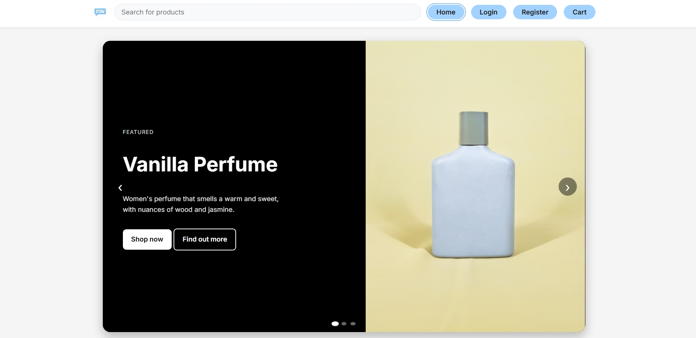
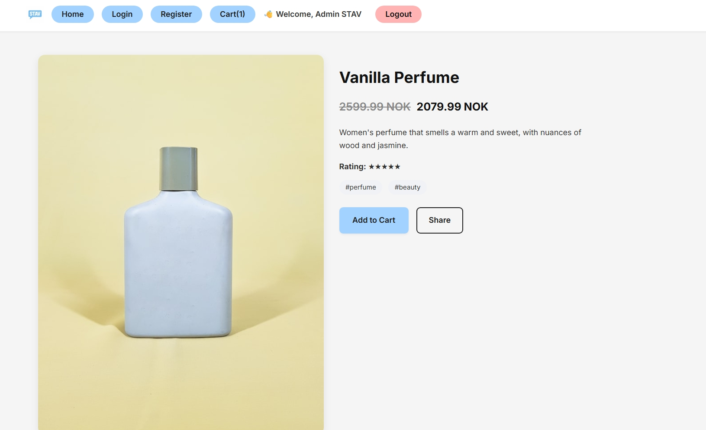
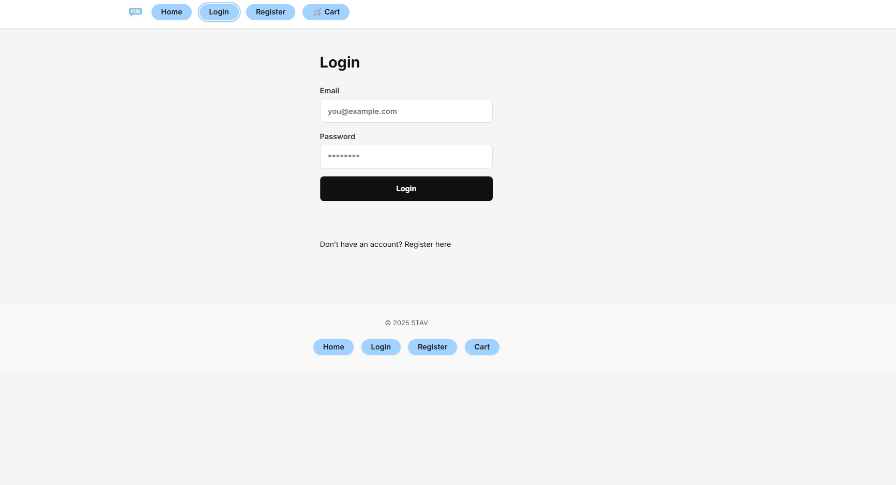
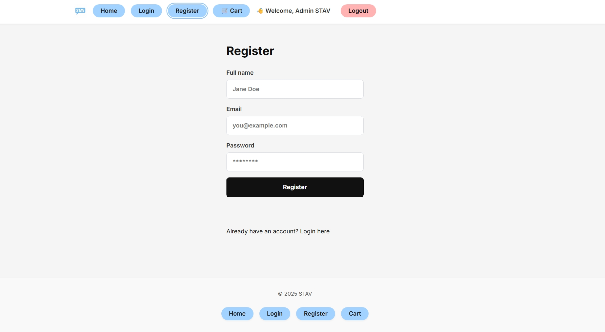
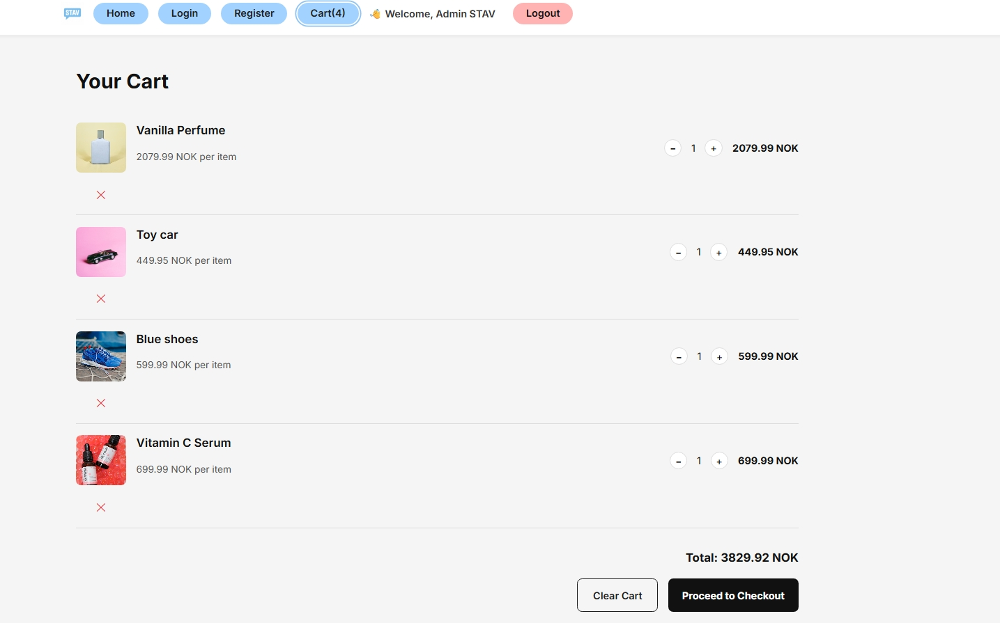
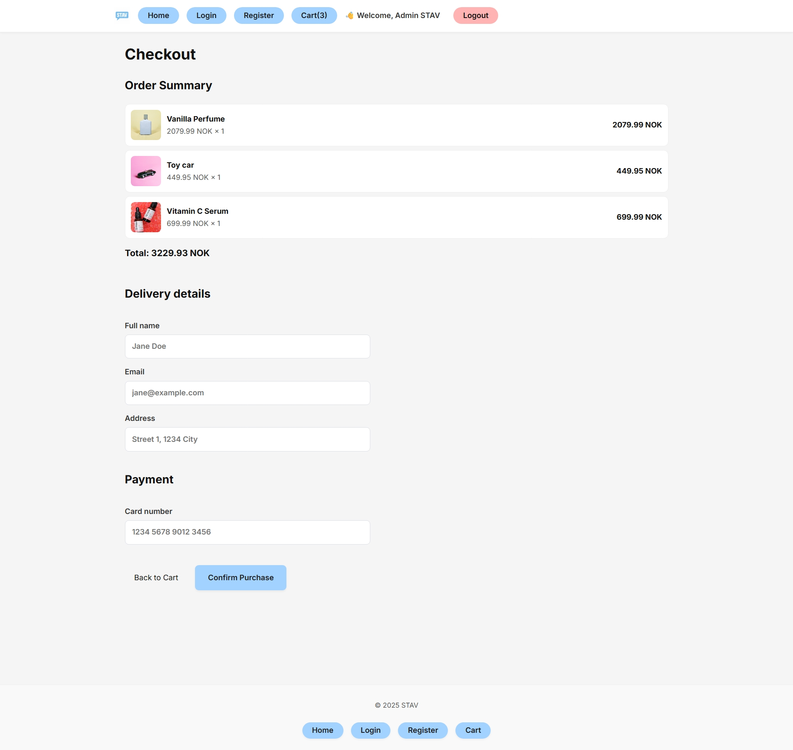
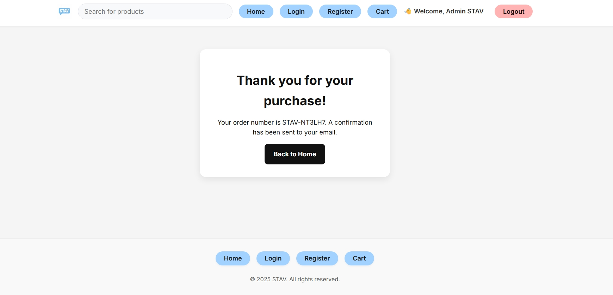

 # PE1- Lloyd Bjelland

 This project was created as Project Exam 1 in the Front-End Development program (FED1)

The goal of the project was to build a responsive front-end e-commerce website usin HTML,CSS,and JavaScript, connected to an external API. Users can browse products, view product details, add items to a cart, and complete a checkout flow, and login and register an account.

## Screenshots 📸

### Homepage


### Product Page


### Login


### Register


### Cart


### Checkout


### Checkout Success


## Built With

- HTML
- CSS
- JavaScript
- External REST API
- GitHub Pages

## Installation

Clone the repository:

```bash
git clone https://github.com/Bjelland14/PE1-Lloyd-Bjelland.git

Open the repository folder: 
cd PE1-Lloyd-Bjelland

Install dependencies and start the development server:
npm install
npm run dev

## Contact
- LinkedIn: https://www.linkedin.com/in/lloyd-bjelland-355659399/
- Email: lloydbjelland@gmail.com